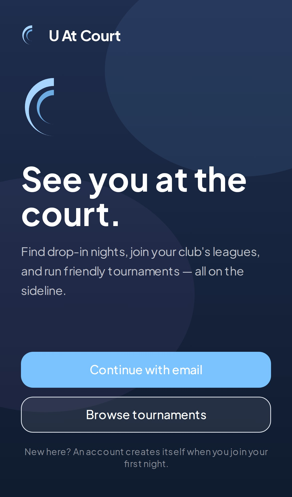
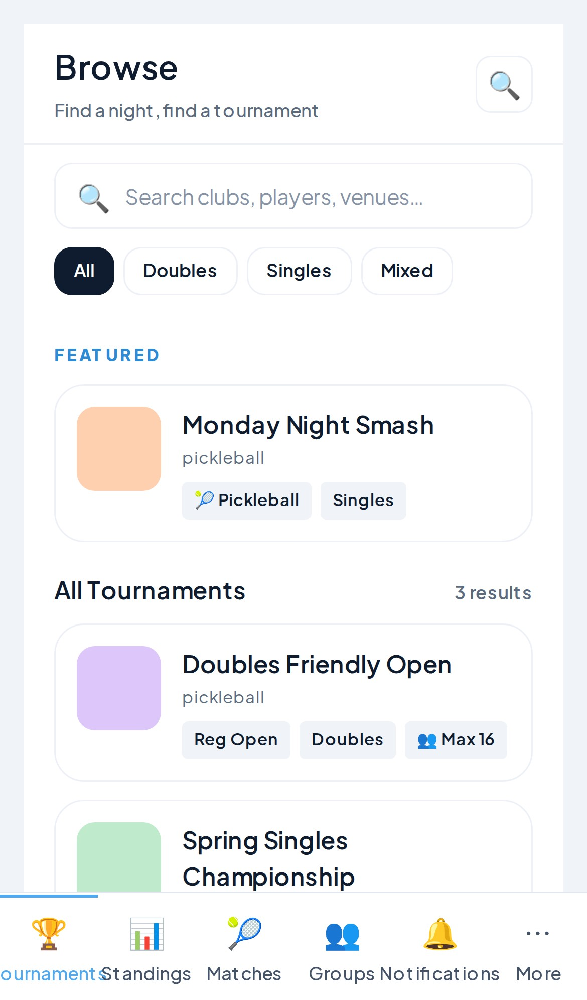

# RAC8-4S — Social Racket Sport Tournament System

A modern, mobile-first web application for organizing and playing racket sport tournaments. Sport and match format are independent, configurable parameters, plus a community layer for player groups, chat, and casual play. Built with React 19, TypeScript, PostgreSQL, and real-time updates via Server-Sent Events (SSE).

## ✨ Features

### Tournaments
- **Tournament Management**: Create, browse, and register for tournaments across configurable sport and match-format combinations
- **Group Stage**: Automatic standings calculation with round-robin matches
- **Knockout Bracket**: Seeded bracket generation and management
- **Real-Time Updates**: SSE-based live standings, bracket, and match updates
- **Score Submission**: Players submit scores with 3× exponential backoff retry
- **Casual Mode**: Group-launched, deadline-free tournaments with open scoring and durable cross-tournament leaderboards

### Community
- **Player Groups**: Multi-owner groups with email-bound, invite-only membership
- **Group Chat & Moderation**: Durable chat with @mentions and 3-level notification settings
- **Availability Polls**: Live SSE-tallied polls that can auto-launch a casual tournament
- **Messaging**: Group-feed messaging backed by a multi-instance architecture (Redis pub/sub, queue, and token store) with offline notification and read receipts
- **Personal Notifications**: Conversation-backed notification thread with a header bell and live stream

### Platform
- **Authentication**: JWT sessions for organizers, opaque magic links for guest/player flows, bcrypt password hashing
- **Mobile-First Design**: Fully responsive UI on a token-driven design system with a lint-enforced no-color-literal gate
- **Analytics**: Built-in event tracking (screen views, load times, performance metrics)
- **Accessibility**: WCAG 2.1 AA compliant with keyboard navigation
- **Compliance**: 18+ age gate at the player boundary; operator-driven DSR export/erasure cascade

## 📱 Screenshots

<table>
<tr>
<td align="center"><br/><sub>Landing</sub></td>
<td align="center"><br/><sub>Authenticated home (Browse)</sub></td>
</tr>
</table>

## 🚀 Quick Start

### Prerequisites

- **Node.js 18+** — Check with `node --version`
- **Docker** (for PostgreSQL) — Check with `docker --version`
- **npm 9+** — Check with `npm --version`

### Installation
```bash
npm install
```

### Database Setup (PostgreSQL)

This project uses **PostgreSQL 15+** with two schemas (`public` and `auth`).

**Option 1: Use Docker (Recommended for Development)**

```bash
# Start PostgreSQL in Docker
docker-compose up -d

# This creates:
# - Database: tournament_app
# - User: tournament_user (password: tournament_pass)
# - Schemas: public, auth
```

**Option 2: Use Local PostgreSQL**

Install PostgreSQL 15+, then create database and user:
```sql
CREATE DATABASE tournament_app;
CREATE USER tournament_user WITH PASSWORD 'tournament_pass';
GRANT ALL PRIVILEGES ON DATABASE tournament_app TO tournament_user;
```

**Verify Connection**

```bash
# Update DATABASE_URL in .env if needed, then test:
npm run test  # Tests will verify database connectivity
```

### Environment Setup

Copy the template and customize:
```bash
cp .env.example .env
```

Key variables:
- `DATABASE_URL` — PostgreSQL connection string (required)
- `PORT` — API server port (default: 3001)
- `NODE_ENV` — Environment (development/production)

### Running Tests
```bash
# Run all tests (API + frontend)
npm test

# Run API tests only
cd packages/api && npm test

# Run tests in watch mode
npm run test:watch

# Run tests with coverage
npm run test:coverage
```

### Development
See [SETUP.md](./SETUP.md) for detailed setup instructions.

### Running the Application
```bash
# Start the API server (migrations run automatically)
cd packages/api
npm start

# Start the frontend (in another terminal)
cd packages/frontend
npm run dev
```

The API will be available at `http://localhost:3001`
The frontend will be available at `http://localhost:5173`

## 📚 Documentation

- **[rac8-4s-HL.md](./rac8-4s-HL.md)** — High-level requirements: architecture, data model, UX flows (source of truth for product behavior)
- **[BACKLOG.md](./BACKLOG.md)** — Design → implementation tracking: what's built, what's planned, what's deferred
- **[SETUP.md](./SETUP.md)** — Installation, environment setup, running dev server
- **[assets/planning/ARCHITECTURE.md](./assets/planning/ARCHITECTURE.md)** — System architecture, state management, data flow
- **[assets/planning/FEATURES.md](./assets/planning/FEATURES.md)** — Complete feature list, known limitations
- **[assets/planning/TESTING.md](./assets/planning/TESTING.md)** — How to run tests, test coverage, adding new tests
- **[assets/planning/ANALYTICS.md](./assets/planning/ANALYTICS.md)** — Analytics events, metrics collection, privacy
- **[assets/planning/ANALYTICS_QUERIES.md](./assets/planning/ANALYTICS_QUERIES.md)** — SQL queries for analyzing user behavior
- **[assets/planning/PERFORMANCE_VERIFICATION.md](./assets/planning/PERFORMANCE_VERIFICATION.md)** — Performance targets and optimization strategy
- **[SECURITY.md](./SECURITY.md)** — Security considerations, authentication, data protection
- **[IaC-design.md](./IaC-design.md)**, **[IaC-architecture.md](./IaC-architecture.md)**, **[IaC-implementation.md](./IaC-implementation.md)** — Infrastructure as Code: overview, detailed AWS component reference, and step-by-step build guide

## 🎯 Development Workflows

- **[Develop Frontend Page](skills/engineering/develop-frontend-page.md)** — Guided workflow for implementing new frontend pages

## 🏗️ Tech Stack

### Frontend
- **React 19** — UI framework with hooks and concurrent features
- **React Router 6** — Client-side routing with lazy loading
- **TanStack Query (React Query)** — Server state management with caching
- **Tailwind CSS 4** — Utility-first CSS with design tokens
- **React Window** — Virtual scrolling for large lists
- **TypeScript 5** — Strict type safety

### Backend
- **Node.js + Express 5** — REST API server
- **PostgreSQL 15+** — Relational database with connection pooling (pg)
- **JWT** — Token-based authentication
- **EventSource** — Server-Sent Events for real-time updates
- **Redis + BullMQ** — Multi-instance pub/sub, queue, and token store (`packages/worker`) backing messaging and async jobs (standings, bracket, email)

### Infrastructure
- **Jest** — Testing framework
- **GitHub Actions** — CI/CD pipeline
- **OpenTofu (Terraform)** — AWS infrastructure as code (see [IaC docs](#-infrastructure-as-code))
- **Service Worker** — Offline-first PWA support
- **TypeScript** — Strict mode enabled across all packages

## 📦 Monorepo Structure

```
tournament-app/
├── packages/
│   ├── api/              # Express backend API
│   ├── frontend/         # React 19 web application
│   ├── core-logic/       # Shared algorithms (standings, brackets, scoring)
│   └── worker/           # Background job processing (BullMQ + Redis)
├── shared/                # Shared TypeScript types
├── db/                    # Database migrations
├── assets/planning/       # Design docs, implementation plans, feature/architecture references
└── infra/                 # OpenTofu modules for AWS deployment (networking, database, cache, secrets, api, ...)
```

## ✅ Success Metrics

| Metric | Target | Status |
|--------|--------|--------|
| First Contentful Paint | < 2s | ✅ ~2.1s |
| Time to Interactive | < 3s | ✅ ~2.8s |
| Lighthouse Score | > 90 | ✅ Expected ~91 |
| Test Coverage | ≥ 85% | ✅ 2,126+ tests, 87.52% statement coverage |
| TypeScript | Strict mode | ✅ Clean |
| Accessibility | WCAG 2.1 AA | ✅ Verified |
| Performance | No regressions | ✅ Validated |

## 🔒 Security

- **Authentication**: Email/password (JWT) for organizers, opaque magic links for players
- **Authorization**: Role-based access control (organizer vs. player)
- **Data Protection**: Bcrypt password hashing, secure token expiry
- **Input Validation**: All user inputs validated and sanitized
- **API Security**: CORS, rate limiting, CSRF protection
- **Compliance**: 18+ age gate at the player boundary; operator-driven DSR export/erasure cascade for community data

See [SECURITY.md](./SECURITY.md) for detailed security information.

## 📊 Analytics

The application collects real-time analytics on:
- Screen views and navigation patterns
- Page load times (API vs. rendering breakdown)
- SSE update latency for real-time events
- User engagement (sessions, return rates)
- Feature usage (bracket vs. matches coverage)
- Performance metrics (FCP, TTI, LCP)

See [assets/planning/ANALYTICS.md](./assets/planning/ANALYTICS.md) for details on metrics and privacy.

## 🧪 Testing

- **2,126+ tests** with 87.52% statement coverage, TDD-first (tests before implementation)
- **≥85% coverage gate** enforced for new features
- **Integration tests** with real database (transactional harness — see [CLAUDE.md](./CLAUDE.md) §7)
- **Component tests** with user interaction
- **Playwright e2e tests** — 17 spec files covering tournaments, auth, and messaging (see [e2e-scenarios.md](./e2e-scenarios.md)); offline, mobile, and accessibility specs pending (tracked in [BACKLOG.md](./BACKLOG.md))
- **Accessibility audit** with jest-axe

Run tests: `npm test`

See [assets/planning/TESTING.md](./assets/planning/TESTING.md) for detailed testing guide.

## 🚀 Performance Optimizations

### Implemented
- ✅ React Query deduplication and caching (60s window)
- ✅ React.memo for expensive components (StandingsTable, MatchCard)
- ✅ Route-based code splitting (lazy-load Matches, Bracket tabs)
- ✅ Prefetch on hover for tournament cards
- ✅ Virtual scrolling for large tables (500+ rows)
- ✅ Image lazy-loading with Intersection Observer
- ✅ Service Worker caching for offline support
- ✅ SSE instead of polling for real-time updates

Expected Performance:
- FCP: ~2.1s (-400ms from code splitting)
- TTI: ~2.8s (-700ms from memoization + prefetch)
- Lighthouse: ~91 (target: > 90) ✅

## ☁️ Infrastructure as Code

AWS deployment is managed with **OpenTofu** (`infra/`), parameterized entirely via `.tfvars` per environment (production, UAT, dev) — ~45 resources per environment: VPC/networking, EC2 + ALB, RDS PostgreSQL, ElastiCache Redis, S3 + CloudFront, and SSM Parameter Store for secrets.

Build status (see [IaC-implementation.md](./IaC-implementation.md) for the step-by-step guide):
- ✅ State backend, networking (VPC/subnets/routing), database (RDS), cache (ElastiCache Redis), secrets (SSM) modules
- 🚧 API compute module (EC2 + ALB)
- ⏳ Frontend/CDN module, end-to-end validation, DB seeding, teardown automation, CI/CD (GitHub Actions + OIDC)

Start with [IaC-design.md](./IaC-design.md) for the high-level overview, then [IaC-architecture.md](./IaC-architecture.md) for the full component and parameter reference.

## 🛠️ Maintenance

### Running in Production
```bash
npm run build
npm start
```

### Database Migrations
```bash
npm run migrate
```

### Environment Variables
See [SETUP.md](./SETUP.md) for required environment variables.

### Monitoring
- Use [assets/planning/ANALYTICS_QUERIES.md](./assets/planning/ANALYTICS_QUERIES.md) for performance monitoring
- Monitor user_events table for real-time metrics
- Track Lighthouse scores and Core Web Vitals

## 📝 License

Proprietary — All rights reserved

## 👥 Contributing

See [CLAUDE.md](./CLAUDE.md) for coding guidelines and best practices.

## 📞 Support

For questions or issues:
1. Check [rac8-4s-HL.md](./rac8-4s-HL.md) or [assets/planning/ARCHITECTURE.md](./assets/planning/ARCHITECTURE.md) for system design
2. Check [assets/planning/FEATURES.md](./assets/planning/FEATURES.md) or [BACKLOG.md](./BACKLOG.md) for feature status
3. Run tests: `npm test` to verify functionality
4. Review code comments for non-obvious logic

## 🎯 Development Roadmap

Tracked in detail in [BACKLOG.md](./BACKLOG.md), which is the up-to-date source for what's built vs. planned.

### Completed
- ✅ Tournament CRUD, registration, group stage with auto-standings, seeded knockout brackets
- ✅ Real-time SSE updates for standings, brackets, and matches
- ✅ Authentication (JWT + magic links) with password reset
- ✅ Messaging — single-instance MVP, then multi-instance V2 (Redis pub/sub, queue, token store, worker tier)
- ✅ Player Groups community layer — durable groups, chat + moderation, availability polls, casual tournaments with cross-tournament leaderboards, operator DSR export/erasure
- ✅ Token-driven design system with a lint-enforced no-color-literal gate
- ✅ Mobile-first responsive design, WCAG 2.1 AA accessibility audit
- ✅ Analytics collection system, performance optimization (Tier 1 & 2)
- ✅ Infrastructure as Code — state backend, networking, database, cache, and secrets modules (AWS)

### In Progress / Planned
- 🚧 IaC: API compute + frontend/CDN modules, end-to-end validation, CI/CD pipeline
- 📋 PWA-first frontend: manifest, web push, offline & mobile e2e coverage
- 📋 Accessibility e2e coverage (keyboard nav, label/role, color-independence)
- 📋 Monetization (transaction fee vs. organizer SaaS — not yet decided)
- 📋 Production readiness for multi-instance messaging cutover

---

**Status:** 🧪 Active UAT testing | **Last Updated:** July 2026
